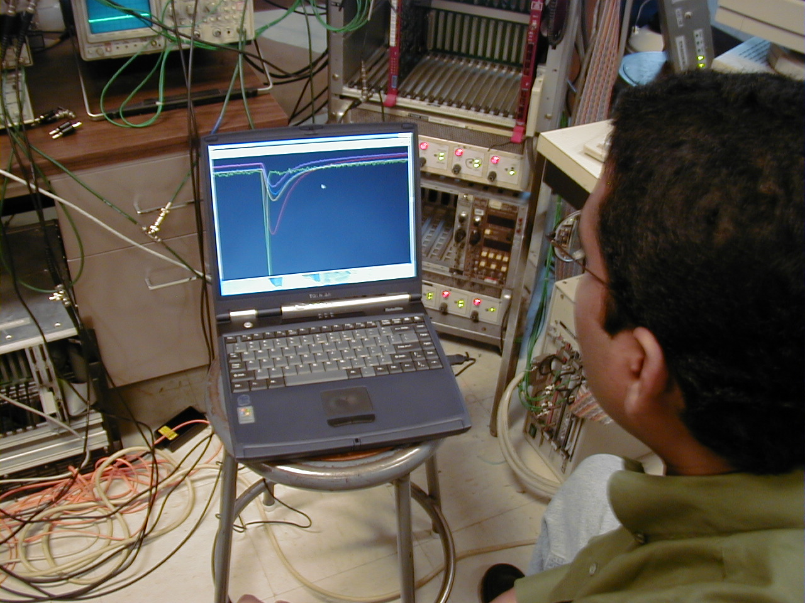
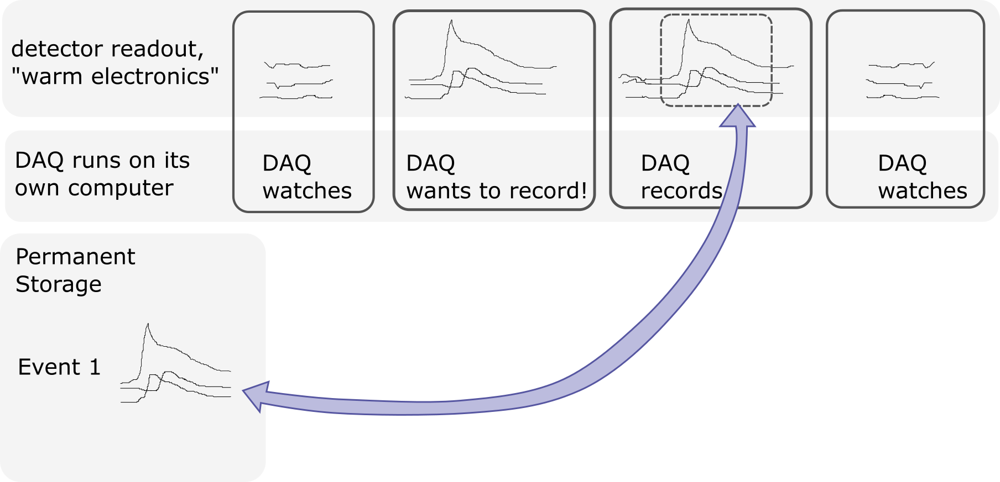
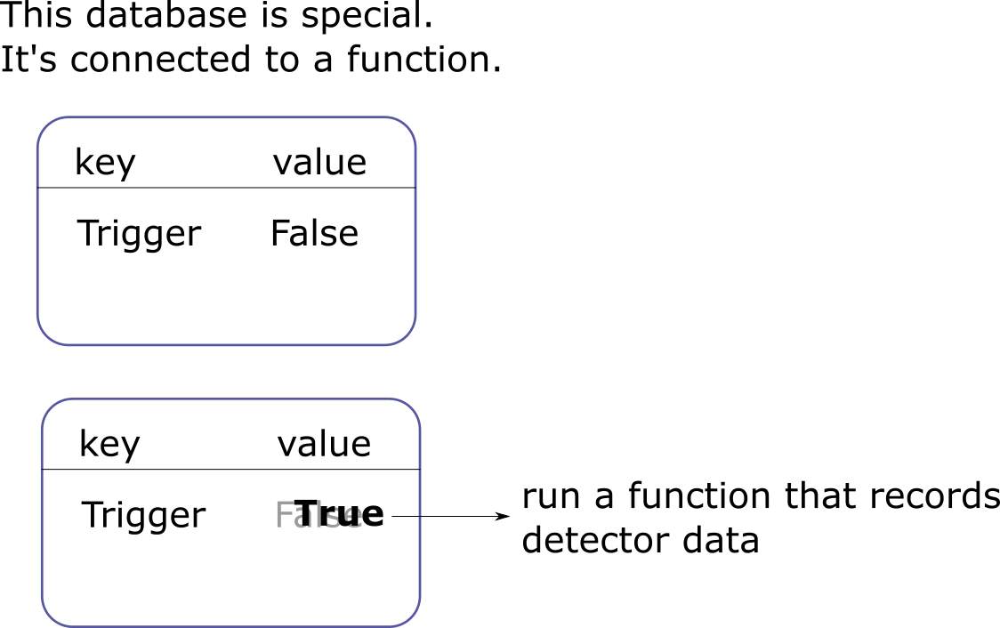
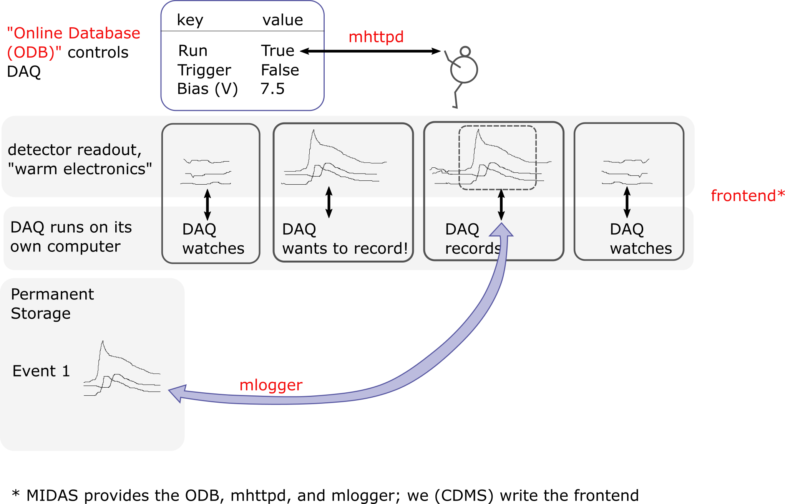

CDMS Data Acquisition and You
=============================
:icons: font
:toc2:
:toclevels: 1

.Record data and explore your world.

Start by thinking about physics!
--------------------------------
image::DAQ_scenario.PNG[width=500]

WARNING: What units should our intrepid physicists use??

What do we need to answer the physics question?
-----------------------------------------------

=== Know the shape and mass of your detector
Not the focus of this talk.

=== Know the livetime of your experiment <- DAQ!
Incredibly simple for some experiments; moderately complex for CDMS.  Not discussed in this talk.

=== Record what your detectors see <- DAQ!
The main focus of this talk.

How you do this depends on the physics question you're asking and your detectors.  There are three basic ways to record data:

* recording discrete events
* continuous recording
* selective recording <- CDMS uses this!

Writing your first DAQ
----------------------
There are many (many, many) ways to write a DAQ.  Here, I illustrate one possible method.

- [line-through]#you'll want a start button# ignore - distraction!
- [line-through]#and of course a stop button# ignore - distraction!
- and how will you tell it to record data from a detector?

This method is roughly similar to that of the MIDAS DAQ, which is developed by a group of physicists from PSI (a lab in Germany) and Triumf (a lab in Canada).

* edit the database to control the DAQ
* write functions that interact with your hardware

MIDAS DAQ: terms MIDAS uses
---------------------------
Some terms used in this talk are common to everyone in the DAQ community (livetime, readout electronics).

CDMS uses custom language for the readout electronics: cold hardware, and warm hardware.

MIDAS uses specialized language to describe the different components of its DAQ.

The End
-------
This talk focuses on the "record the data" job of data acquisition.  It ignores the "know the livetime" piece entirely!

You should now understand that
* MIDAS is a set of data acquisition programs.  It operates by using a database that triggers functions when we change its values.
* MIDAS calls this database the "Online Database", or "ODB".
* The MIDAS program mhttpd gives us access to the ODB.
* The MIDAS program mlogger is responsible for writing data to disk.
* We have to write a program that talks to our readout hardware.  MIDAS calls such a program a "frontend".

